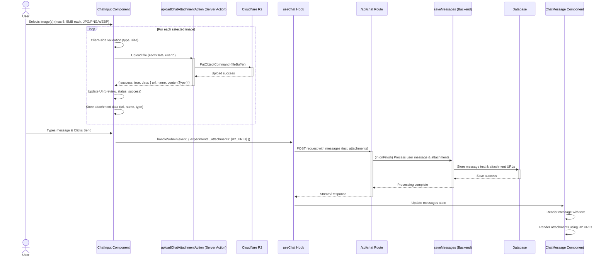

# Detailed Implementation Plan: Chat Image Attachments

## 1. Introduction

This document outlines the detailed plan to implement image attachment functionality within the chatbot application. Users will be able to attach images (JPG, PNG, WEBP) to their chat messages.

**Key Specifications:**
*   **Supported File Types:** JPEG, PNG, WEBP.
*   **Maximum File Size:** 5MB per file.
*   **Maximum Files per Message:** 5 files.
*   **Storage Backend:** Cloudflare R2 (leveraging existing setup).
*   **Core Library:** AI SDK for chat state management and attachment handling (`experimental_attachments`).

The implementation will involve backend changes for file uploading and storage, database schema modifications, and client-side enhancements for file selection, preview, upload management, and display.

## 2. Overall Workflow Diagram

The following diagram illustrates the end-to-end flow of a user attaching an image and sending a message:



## 3. Phase 1: Backend & Core Logic

### Step 3.1: Database Schema Modification
*   **File to Modify:** `db/schema/chat.ts` (or your equivalent chat message schema file).
*   **Action:** Add a new column to your `messages` table (or the table storing chat messages).
    *   **Column Name:** `attachments`
    *   **Data Type:** `JSONB` (for PostgreSQL). If using another database, `JSON` is an alternative, though `JSONB` offers better performance for querying if needed.
    *   **Purpose:** This column will store an array of attachment objects associated with the message.
    *   **Example Structure for the `attachments` column value:**
        ```json
        [
          { "url": "https://your-r2-public-url.com/chat-attachments/user123/1678886400000-image1.png", "name": "image1.png", "contentType": "image/png" },
          { "url": "https://your-r2-public-url.com/chat-attachments/user123/1678886400001-photo.jpg", "name": "photo.jpg", "contentType": "image/jpeg" }
        ]
        ```
    *   **Nullability:** The column should be nullable, as not all messages will have attachments.
*   **Task:**
    1.  Modify the Drizzle schema definition in `db/schema/chat.ts`.
    2.  Generate a new database migration using Drizzle Kit: `pnpm drizzle-kit generate:pg` (or your specific command).
    3.  Review the generated migration SQL file.
    4.  Apply the migration to your database: `pnpm drizzle-kit push:pg` (or your specific command).
*   **Considerations:**
    *   This change is non-breaking for existing data as it's a new nullable column.
    *   If you anticipate needing to query messages based on attachment properties (e.g., find all messages with PNG attachments), `JSONB` provides better indexing capabilities. For now, we primarily need to store and retrieve.

### Step 3.2: New Server Action for Chat Attachment Uploads
*   **File Location:** Create a new file `db/actions/chat-attachment.actions.ts` or add to an existing relevant server actions file.
*   **Function Definition:**
    ```typescript
    // In db/actions/chat-attachment.actions.ts
    'use server';

    import { S3Client, PutObjectCommand } from "@aws-sdk/client-s3";
    import { auth } from "@/lib/auth";
    import { headers } from "next/headers";
    import type { ActionResult } from "./types"; // Assuming ActionResult is defined

    // Reuse R2 configuration from agent.actions.ts or centralize it
    const R2_ENDPOINT = process.env.R2_ENDPOINT;
    const R2_ACCESS_KEY = process.env.R2_ACCESS_KEY;
    const R2_SECRET_KEY = process.env.R2_SECRET_KEY;
    const R2_BUCKET_NAME = process.env.R2_BUCKET_NAME;
    const R2_PUBLIC_URL_BASE = process.env.R2_PUBLIC_URL_BASE;

    let s3Client: S3Client | null = null;
    if (R2_ENDPOINT && R2_ACCESS_KEY && R2_SECRET_KEY) {
        s3Client = new S3Client({
            region: "auto",
            endpoint: R2_ENDPOINT,
            credentials: {
                accessKeyId: R2_ACCESS_KEY,
                secretAccessKey: R2_SECRET_KEY,
            },
        });
    } else {
        console.warn("R2 S3 client for chat attachments is not fully configured.");
    }

    const CHAT_ATTACHMENT_MAX_FILE_SIZE = 5 * 1024 * 1024; // 5MB
    const CHAT_ATTACHMENT_ALLOWED_FILE_TYPES = ["image/jpeg", "image/png", "image/webp"];

    interface UploadedAttachmentData {
      url: string;
      name: string;
      contentType: string;
    }

    export async function uploadChatAttachmentAction(
        formData: FormData,
        userId: string // Passed from client, verified against session
    ): Promise<ActionResult<UploadedAttachmentData>> {
        if (!s3Client || !R2_BUCKET_NAME || !R2_PUBLIC_URL_BASE) {
            return { success: false, error: "Server configuration error for file uploads." };
        }

        try {
            const session = await auth.api.getSession({ headers: await headers() });
            if (!session?.user || session.user.id !== userId) {
                return { success: false, error: "Unauthorized." };
            }

            const file = formData.get("file") as File | null;

            if (!file) {
                return { success: false, error: "No file provided." };
            }
            if (!CHAT_ATTACHMENT_ALLOWED_FILE_TYPES.includes(file.type)) {
                return { success: false, error: `Invalid file type. Allowed: ${CHAT_ATTACHMENT_ALLOWED_FILE_TYPES.join(', ')}.` };
            }
            if (file.size > CHAT_ATTACHMENT_MAX_FILE_SIZE) {
                return { success: false, error: `File size exceeds ${CHAT_ATTACHMENT_MAX_FILE_SIZE / 1024 / 1024}MB.` };
            }

            const fileBuffer = Buffer.from(await file.arrayBuffer());
            const sanitizedFilename = file.name.replace(/[^a-zA-Z0-9._-]/g, '_'); // Basic sanitization
            const fileExtension = sanitizedFilename.split('.').pop() || 'bin'; // Fallback extension
            const key = `chat-attachments/${userId}/${Date.now()}-${sanitizedFilename}`;

            await s3Client.send(
                new PutObjectCommand({
                    Bucket: R2_BUCKET_NAME,
                    Key: key,
                    Body: fileBuffer,
                    ContentType: file.type,
                    ACL: 'public-read', // Make object publicly readable via its URL
                })
            );

            const publicUrl = `${R2_PUBLIC_URL_BASE}/${key}`;

            return {
                success: true,
                data: {
                    url: publicUrl,
                    name: file.name, // Original filename for display
                    contentType: file.type,
                },
            };
        } catch (error) {
            console.error("Failed to upload chat attachment:", error);
            return { success: false, error: `Upload failed: ${(error as Error).message}` };
        }
    }
    ```
*   **R2 Key Generation Strategy:** `chat-attachments/[userId]/[timestamp]-[sanitizedFilename].[extension]`
    *   `chat-attachments/`: Root folder for all chat-related uploads.
    *   `[userId]/`: Organizes files by user, useful for potential per-user quotas, lifecycle rules, or targeted deletion if a user account is removed.
    *   `[timestamp]-`: Ensures uniqueness even if a user uploads files with the same name. `Date.now()` provides millisecond precision.
    *   `[sanitizedFilename]`: Includes a sanitized version of the original filename for easier identification in R2, while removing potentially problematic characters.
*   **Considerations:**
    *   Ensure R2 bucket policies are secure. While objects are `public-read` via their direct URL, the bucket itself should not allow public listing unless intended.
    *   Error messages returned to the client should be informative but not expose sensitive server details.

### Step 3.3: Update Backend API (`app/api/chat/route.ts`) to Save Attachments
*   **File to Modify:** `app/api/chat/route.ts`.
*   **Location of Change:** Inside the `onFinish` callback of the `streamText` call, specifically where the user's message is prepared for saving.
*   **Action:**
    *   The `userMessage` object (which is part of the `messages` array passed to `streamText`) will now potentially have an `experimental_attachments` field populated by the client with the R2 URLs.
    *   Modify the object passed to `saveMessages` (or its underlying repository function) to include this `attachments` array.
    *   **Example (around line 247-259 in the provided `app/api/chat/route.ts`):**
        ```typescript
        // Inside onFinish, when saving the user message
        // Ensure userMessage is typed to include experimental_attachments
        // or cast appropriately. The AI SDK UIMessage type should include it.
        const userMessageForDb = {
            id: userMessage.id,
            chatId: chatId,
            role: 'user' as const, // Ensure role is literal type
            parts: userMessage.parts,
            // ADD THIS: Get attachments from the userMessage object sent by the client
            attachments: (userMessage as any).experimental_attachments?.map(att => ({ // Cast if type is not yet updated
                url: att.url,
                name: att.name,
                contentType: att.contentType,
            })) ?? [],
            createdAt: new Date(), // Or use userMessage timestamp if available
            model_id: null // User messages don't have a model_id
        };

        await saveMessages({
            messages: [userMessageForDb], // Pass the modified user message
        });
        ```
*   **Repository Update:**
    *   **File:** `db/repository/chat-repository.ts` (or where `saveMessages` / `insertMessage` is defined).
    *   **Action:** The function responsible for inserting messages into the database must be updated to:
        1.  Accept the `attachments` array as part of its input for each message.
        2.  Correctly map this array to the new `attachments` (JSONB) column in the database insert/update statement.
        *   Example (conceptual, depends on your Drizzle setup):
            ```typescript
            // In your repository function
            // Assuming 'db' is your Drizzle instance and 'chatMessagesTable' is your schema
            // And 'messageData' is an object like userMessageForDb above

            await db.insert(chatMessagesTable).values({
                id: messageData.id,
                chatId: messageData.chatId,
                role: messageData.role,
                // Assuming 'parts' is also JSONB or handled appropriately
                parts: messageData.parts,
                attachments: messageData.attachments, // This will be serialized to JSONB
                createdAt: messageData.createdAt,
                modelId: messageData.model_id,
                // ... other fields ...
            });
            ```
*   **Considerations:**
    *   Type safety: Ensure that the types used throughout the data flow (client `useChat`, API route, repository) correctly reflect the structure of `experimental_attachments`.
    *   The AI SDK documentation for `experimental_attachments` specifies it as `Array<Attachment>`, where `Attachment` has `name?: string`, `contentType?: string`, and `url: string`. Ensure your saved structure matches this or is compatible.

## 4. Phase 2: Client-Side Implementation

### Step 4.1: Enhance `ChatInput` Component
*   **File to Modify:** `components/ui/chat-input.tsx`.
*   **State Management (within `ChatInputComponent`):**
    ```typescript
    interface PendingAttachment {
      id: string; // Unique ID for UI key, e.g., generated by crypto.randomUUID()
      file: File;
      previewUrl: string; // Blob URL for local preview
      status: 'pending' | 'uploading' | 'success' | 'error';
      error?: string;
      // Data from successful R2 upload:
      uploadedUrl?: string;
      uploadedName?: string; // Original filename
      uploadedContentType?: string;
    }

    const [pendingAttachments, setPendingAttachments] = useState<PendingAttachment[]>([]);
    const [isUploadingAny, setIsUploadingAny] = useState(false); // Optional: general uploading indicator
    const fileInputRef = useRef<HTMLInputElement>(null); // Already present for MemoizedFileButton
    ```
*   **File Selection & Upload Trigger:**
    *   The existing `MemoizedFileButton` ([`components/ui/chat-input.tsx:33`](components/ui/chat-input.tsx:33)) has an `onChange` prop. This is connected to `handleFileChange` ([`components/ui/chat-input.tsx:168`](components/ui/chat-input.tsx:168)) in `ChatInputComponent`, which then calls the `onFileSelect` prop.
    *   We will modify `handleFileChange` in `ChatInputComponent` to directly handle the attachment logic instead of relying on an `onFileSelect` prop for this specific feature.
    *   **Modified `handleFileChange` in `ChatInputComponent`:**
        ```typescript
        const handleAttachmentFileChange = async (event: React.ChangeEvent<HTMLInputElement>) => {
            const files = event.target.files;
            if (!files) return;

            const currentAttachmentCount = pendingAttachments.length;
            const filesToProcess = Array.from(files).slice(0, 5 - currentAttachmentCount); // Max 5 files

            if (filesToProcess.length === 0 && files.length > 0) {
                toast.info("You can attach a maximum of 5 files.");
                return;
            }
            if (files.length > 5) {
                 toast.info(`Selected ${files.length} files. Attaching the first ${5 - currentAttachmentCount} valid files (up to 5 total).`);
            }


            setIsUploadingAny(true); // General indicator

            for (const file of filesToProcess) {
                // Client-side validation
                if (!CHAT_ATTACHMENT_ALLOWED_FILE_TYPES.includes(file.type)) {
                    toast.error(`Invalid file type: ${file.name}. Allowed: JPG, PNG, WEBP.`);
                    continue;
                }
                if (file.size > CHAT_ATTACHMENT_MAX_FILE_SIZE) {
                    toast.error(`File too large: ${file.name}. Max: 5MB.`);
                    continue;
                }

                const attachmentId = crypto.randomUUID();
                const previewUrl = URL.createObjectURL(file);
                const newAttachmentEntry: PendingAttachment = {
                    id: attachmentId,
                    file,
                    previewUrl,
                    status: 'pending',
                };

                setPendingAttachments((prev) => [...prev, newAttachmentEntry]);

                // Immediately start upload
                setPendingAttachments((prev) =>
                    prev.map((att) => (att.id === attachmentId ? { ...att, status: 'uploading' } : att))
                );

                const uploadFormData = new FormData();
                uploadFormData.append('file', file);

                // Assuming 'userId' is available in ChatInputProps or from a session hook
                // const { data: session } = authClient.useSession(); // Example if using authClient
                // const userId = session?.user?.id;
                // if (!userId) {
                //     toast.error("User not authenticated. Cannot upload.");
                //     setPendingAttachments((prev) => prev.filter(att => att.id !== attachmentId));
                //     URL.revokeObjectURL(previewUrl);
                //     continue;
                // }

                try {
                    // Ensure userId is available. This might come from props or a context/hook.
                    // For this plan, let's assume `props.userId` is passed to ChatInputComponent.
                    if (!props.userId) throw new Error("User ID not available for upload.");

                    const result = await uploadChatAttachmentAction(uploadFormData, props.userId);

                    if (result.success && result.data) {
                        setPendingAttachments((prev) =>
                            prev.map((att) =>
                                att.id === attachmentId
                                    ? { ...att, status: 'success', uploadedUrl: result.data.url, uploadedName: result.data.name, uploadedContentType: result.data.contentType }
                                    : att
                            )
                        );
                    } else {
                        throw new Error(result.error || 'Upload failed');
                    }
                } catch (error) {
                    console.error(`Upload error for ${file.name}:`, error);
                    toast.error(`Failed to upload ${file.name}: ${(error as Error).message}`);
                    setPendingAttachments((prev) =>
                        prev.map((att) =>
                            att.id === attachmentId
                                ? { ...att, status: 'error', error: (error as Error).message }
                                : att
                        )
                    );
                    // Optionally remove from pendingAttachments or allow retry
                }
            }
            setIsUploadingAny(false);
            if (event.target) event.target.value = ''; // Reset file input
        };
        ```
    *   Update `MemoizedFileButton`'s `onChange` to call this new `handleAttachmentFileChange`.
*   **UI for Pending Attachments:**
    *   Below the `Textarea` ([`components/ui/chat-input.tsx:209`](components/ui/chat-input.tsx:209)), add a section to render `pendingAttachments`:
        ```jsx
        {pendingAttachments.length > 0 && (
            <div className="mt-2 p-2 border rounded-md space-y-2 max-h-40 overflow-y-auto">
                {pendingAttachments.map((att) => (
                    <div key={att.id} className="flex items-center justify-between p-1 bg-muted/50 rounded">
                        <div className="flex items-center gap-2">
                            
                            <span className="text-xs truncate max-w-[150px]">{att.file.name}</span>
                        </div>
                        <div className="flex items-center gap-2">
                            {att.status === 'uploading' && <Loader2 className="w-4 h-4 animate-spin text-muted-foreground" />}
                            {att.status === 'success' && <CheckCircle2 className="w-4 h-4 text-green-500" />}
                            {att.status === 'error' && <XCircle className="w-4 h-4 text-red-500" title={att.error} />}
                            <Button
                                type="button"
                                variant="ghost"
                                size="icon"
                                className="w-6 h-6"
                                onClick={() => {
                                    URL.revokeObjectURL(att.previewUrl);
                                    setPendingAttachments((prev) => prev.filter(a => a.id !== att.id));
                                    // Optional: If att.status === 'success', call a server action to delete from R2
                                }}
                            >
                                <X className="w-3 h-3" />
                            </Button>
                        </div>
                    </div>
                ))}
            </div>
        )}
        ```
        *(Note: `Loader2`, `CheckCircle2`, `XCircle`, `X` are icons, e.g., from `lucide-react`)*
*   **Modifying `handleSubmit` (passed from `useChat`):**
    *   The `handleInternalSubmit` ([`components/ui/chat-input.tsx:151`](components/ui/chat-input.tsx:151)) function is called when the user sends the message.
    *   Modify it to include attachments:
        ```typescript
        // Inside handleInternalSubmit in ChatInputComponent
        const successfullyUploadedAttachments = pendingAttachments
            .filter(att => att.status === 'success' && att.uploadedUrl)
            .map(att => ({
                url: att.uploadedUrl!,
                name: att.uploadedName || att.file.name,
                contentType: att.uploadedContentType || att.file.type,
            }));

        if (inputRef.current.trim() || successfullyUploadedAttachments.length > 0) { // Allow sending if only attachments
            // The handleSubmit prop comes from useChat
            props.handleSubmit(undefined, { // Pass undefined for event if not directly from form event
                experimental_attachments: successfullyUploadedAttachments
            });
            setPendingAttachments([]); // Clear pending attachments after sending
            // ... rest of existing focus logic ...
        }
        ```
*   **Props:** `ChatInputProps` ([`components/ui/chat-input.tsx:10`](components/ui/chat-input.tsx:10)) must include `userId: string;`.
*   **Cleanup `useEffect`:**
    ```typescript
    useEffect(() => {
        return () => {
            pendingAttachments.forEach(att => URL.revokeObjectURL(att.previewUrl));
        };
    // eslint-disable-next-line react-hooks/exhaustive-deps
    }, []); // Run only on unmount by watching pendingAttachments reference itself
    ```

### Step 4.2: Update `Chat` Component
*   **File to Modify:** `components/chat.tsx`.
*   **Action:**
    *   Fetch `userId` (already done via `session?.user?.id` on line 109).
    *   Pass this `userId` as a prop to the `ChatInput` component instances ([`components/chat.tsx:200`](components/chat.tsx:200) and [`components/chat.tsx:215`](components/chat.tsx:215)).
        ```jsx
        // Example for one instance:
        <ChatInput
          // ... existing props
          userId={user?.id} // Pass the userId
        />
        ```

### Step 4.3: Display Attachments in Sent Messages
*   **File to Modify:** `components/chat/message.tsx`.
*   **Action:** In `PurePreviewMessage` ([`components/chat/message.tsx:28`](components/chat/message.tsx:28)), update the rendering for `message.experimental_attachments` ([`components/chat/message.tsx:72`](components/chat/message.tsx:72)):
    ```jsx
    {/* Inside PurePreviewMessage, after message content or where appropriate */}
    {message.experimental_attachments && message.experimental_attachments.length > 0 && (
      <div
        data-testid={`message-attachments-${message.id}`}
        className="mt-2 flex flex-wrap gap-2" // Added gap-2 for spacing
      >
        {message.experimental_attachments.map((attachment, index) => (
          <div key={`${message.id}-attachment-${index}`} className="attachment-item border rounded-md p-1 bg-background/50 max-w-[200px]">
            {attachment.contentType?.startsWith('image/') ? (
              <a href={attachment.url} target="_blank" rel="noopener noreferrer" title={attachment.name || 'View image'}>
                
                {attachment.name && <p className="text-xs text-muted-foreground truncate mt-1">{attachment.name}</p>}
              </a>
            ) : (
              // Fallback for non-image types (though we only allow images for now)
              <a
                href={attachment.url}
                target="_blank"
                rel="noopener noreferrer"
                className="text-sm text-primary hover:underline flex items-center gap-1"
              >
                {/* You might want a generic file icon here */}
                <Paperclip className="w-3 h-3" /> {/* Example icon */}
                {attachment.name || 'View Attachment'}
              </a>
            )}
          </div>
        ))}
      </div>
    )}
    ```
    *(Note: `Paperclip` icon from `lucide-react` or similar)*

## 5. Phase 3: Refinements & Optional Features

### Step 5.1: Implement R2 Deletion for Chat Attachments (Important for Storage Management)
*   **Server Action (e.g., in `db/actions/chat-attachment.actions.ts`):**
    ```typescript
    export async function deleteChatAttachmentAction(attachmentUrl: string): Promise<ActionResult<void>> {
        if (!s3Client || !R2_BUCKET_NAME || !R2_PUBLIC_URL_BASE) {
            return { success: false, error: "Server configuration error." };
        }
        // Basic auth check - ideally, ensure user owns the message associated with attachment
        const session = await auth.api.getSession({ headers: await headers() });
        if (!session?.user) {
            return { success: false, error: "Unauthorized." };
        }

        if (!attachmentUrl.startsWith(R2_PUBLIC_URL_BASE)) {
            return { success: false, error: "Invalid attachment URL." };
        }
        const key = attachmentUrl.substring(R2_PUBLIC_URL_BASE.length + 1); // +1 for the slash

        try {
            await s3Client.send(new DeleteObjectCommand({ Bucket: R2_BUCKET_NAME, Key: key }));
            return { success: true, data: undefined };
        } catch (error) {
            console.error(`Failed to delete R2 object ${key}:`, error);
            return { success: false, error: "Failed to delete attachment from storage." };
        }
    }
    ```
*   **Integration:**
    *   When a message is deleted (if you have message deletion functionality):
        1.  Fetch the message from the DB to get its `attachments` array.
        2.  For each attachment URL, call `deleteChatAttachmentAction`.
        3.  Then delete the message record.
    *   This is crucial to avoid orphaned files in R2.

### Step 5.2: UI/UX Enhancements
*   **Max Files Feedback:** In `ChatInput`, when `pendingAttachments.length` reaches 5, disable the file input or show a message.
*   **Progress Indicators:** For larger files (though 5MB is usually quick), more granular progress might be desired (complex, often involves direct XHR/fetch with progress events, or presigned URLs if R2 supports client-side direct upload with progress). For now, the "uploading" spinner per item is a good start.
*   **Error Display:** Ensure errors for individual file uploads are clearly shown next to the respective file preview.

### Step 5.3: Testing
*   **Uploads:** Test with JPG, PNG, WEBP files of various sizes (up to 5MB).
*   **Limits:** Test exceeding 5MB per file and exceeding 5 files per message.
*   **Error Handling:** Simulate network errors during upload (if possible in dev), test invalid file types.
*   **Display:** Verify attachments render correctly in chat messages for both sender and receiver.
*   **Database:** Check that attachment metadata is correctly stored in the `messages` table.
*   **Deletion (if implemented):** Verify files are removed from R2 when messages are deleted.
*   **Concurrency:** Test uploading multiple files simultaneously.

## 6. Security & Other Considerations
*   **Input Validation:** Continue to perform validation on both client and server sides (file type, size).
*   **R2 Bucket Security:** While objects are `public-read` by URL, ensure the R2 bucket itself does not allow public listing of all its contents unless specifically intended.
*   **Authentication/Authorization:** All server actions must robustly check user authentication and authorization where applicable (e.g., user can only delete attachments associated with their messages or messages they have permission to delete).
*   **Scalability:** The R2-based approach is highly scalable. The server actions are lightweight.
*   **Cost:** R2 is cost-effective, especially with no egress fees. Monitor storage and Class A/B operation costs as usage grows, though the free tiers are generous.

This detailed plan provides a solid foundation for implementing the chat attachment feature.